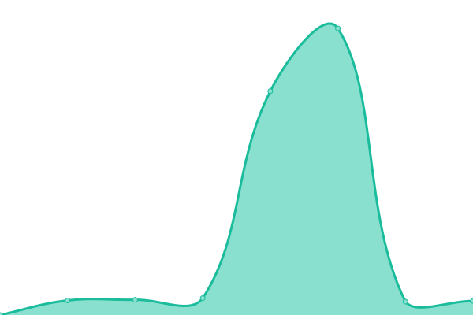
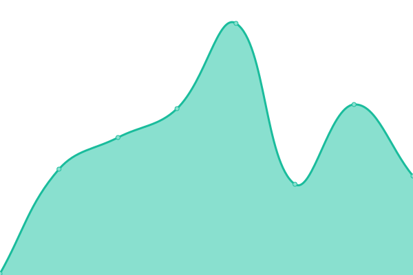
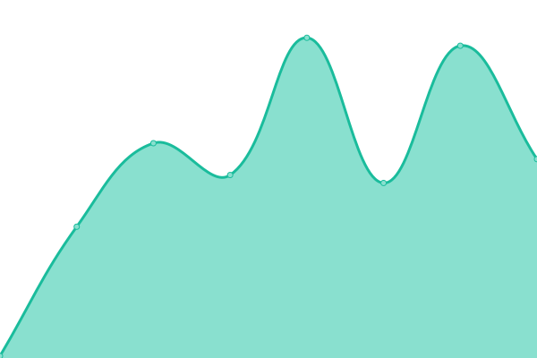

# [📈 Live Status](https://status.photong.ml): <!--live status--> **🟩 All systems operational**

This repository contains the open-source uptime monitor and status page for [Photong](https://photong.ml/), powered by [Upptime](https://github.com/upptime/upptime).

With [Upptime](https://upptime.js.org), you can get your own unlimited and free uptime monitor and status page, powered entirely by a GitHub repository. We use [Issues](https://github.com/photong-ml/photong-status/issues) as incident reports, [Actions](https://github.com/photong-ml/photong-status/actions) as uptime monitors, and [Pages](https://status.photong.ml) for the status page.

<!--start: status pages-->
<!-- This summary is generated by Upptime (https://github.com/upptime/upptime) -->
<!-- Do not edit this manually, your changes will be overwritten -->
<!-- prettier-ignore -->
| URL | Status | History | Response Time | Uptime |
| --- | ------ | ------- | ------------- | ------ |
|  [Photong main site (v3, Cloudflare)](https://photong.ml/) | 🟩 Up | [photong-main-site-v3-cloudflare.yml](https://github.com/photong-ml/photong-status/commits/HEAD/history/photong-main-site-v3-cloudflare.yml) | 

 451ms
     
 | 

<a href="https://status.photong.ml/history/photong-main-site-v3-cloudflare">100.00%</a>
    

|  [Photong v3 site (Azure)](https://v3.photong.ml/) | 🟩 Up | [photong-v3-site-azure.yml](https://github.com/photong-ml/photong-status/commits/HEAD/history/photong-v3-site-azure.yml) | 

 759ms
     
 | 

<a href="https://status.photong.ml/history/photong-v3-site-azure">100.00%</a>
    

|  [Photong v3 backup site (Cloudflare)](https://photong-v3-web.pages.dev/) | 🟩 Up | [photong-v3-backup-site-cloudflare.yml](https://github.com/photong-ml/photong-status/commits/HEAD/history/photong-v3-backup-site-cloudflare.yml) | 

 134ms
     
 | 

<a href="https://status.photong.ml/history/photong-v3-backup-site-cloudflare">91.23%</a>
    

|  [Photong v3 API](https://api-v3.photong.ml/) | 🟩 Up | [photong-v3-api.yml](https://github.com/photong-ml/photong-status/commits/HEAD/history/photong-v3-api.yml) | 

 2423ms
     
 | 

<a href="https://status.photong.ml/history/photong-v3-api">99.15%</a>
    

|  [Photong v2 site (Cloudflare)](https://v2.photong.ml/) | 🟩 Up | [photong-v2-site-cloudflare.yml](https://github.com/photong-ml/photong-status/commits/HEAD/history/photong-v2-site-cloudflare.yml) | 

 354ms
     
 | 

<a href="https://status.photong.ml/history/photong-v2-site-cloudflare">100.00%</a>
    

|  [Photong v2 backup site (Cloudflare)](https://photong-v2-web.pages.dev/) | 🟩 Up | [photong-v2-backup-site-cloudflare.yml](https://github.com/photong-ml/photong-status/commits/HEAD/history/photong-v2-backup-site-cloudflare.yml) | 

 115ms
     
 | 

<a href="https://status.photong.ml/history/photong-v2-backup-site-cloudflare">100.00%</a>
    

<!--end: status pages-->

[**Visit our status website →**](https://status.photong.ml)

## 📄 License

- Powered by: [Upptime](https://github.com/upptime/upptime)
- Code: [MIT](./LICENSE) © [Photong](https://photong.ml/)
- Data in the `./history` directory: [Open Database License](https://opendatacommons.org/licenses/odbl/1-0/)
